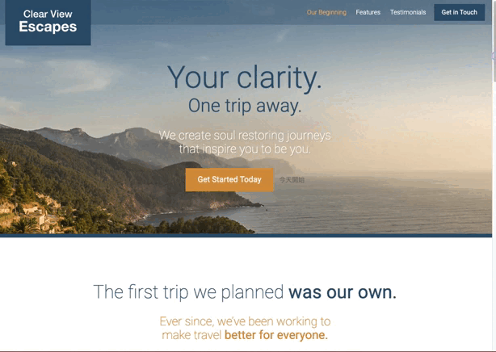

# Udemy Project: Travel Site

This is a hands-on project from the Udemy course - [Git a Web Developer Job: Mastering the Modern Workflow](https://www.udemy.com/course/git-a-web-developer-job-mastering-the-modern-workflow/) by Brad Schiff.

## Table of contents

- [Udemy Project: Travel Site](#udemy-project-travel-site)
  - [Table of contents](#table-of-contents)
  - [Overview](#overview)
    - [Demo](#demo)
    - [Features](#features)
    - [Links](#links)
  - [My process](#my-process)
    - [Built with](#built-with)

## Overview

### Demo

### Features

- Responsive web design (RWD): mobile-first approach, responsive images (resolution switching / different cropping situations)
- Revealing contents on scroll
- Anchor links in header bar
- Classes follow the CSS Architecture with B.E.M rules

### Links

- Live Site URL: [Travel-Site](https://kaiens-lab.github.io/Travel-Site/)

## My process

### Built with

- Semantic HTML5 markup
- CSS custom properties
- Mobile-first workflow
- [postcss](https://postcss.org/)
- [normalize.css](https://nicolasgallagher.com/about-normalize-css/)
- [webpack](https://webpack.js.org/concepts/)
